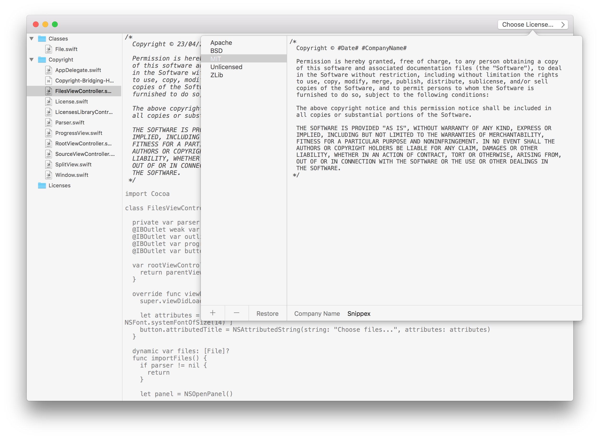

# Copyright

Copyright is a simple application for updating all the copyright info in your iOS or OSX projects.

# How does it work?

Simply open the root folder where your project(s) reside. Copyright will then import previews of all files so you can make sure you only include the file you want to update.

Copyright automatically ignored folders like Pods, Machine, Human, etc... to make it really simple. 

You then click `File -> Update Copyright` and the app will do the rest. 

# Usage

`File -> Import files...` -- imports previews into the app

`File -> Update Copyright` -- Updates all copyright info for the files you're currently previewing

You can also delete previews from the app, to exclude them from your update.

# Licenses

Copyright provides multiple licenses by default, but you can easily add your own custom licenses too. Just select `Choose License...`

# Updates

If the app doens't quite fit your needs, you'll need to modify the code yourself. I built this as a side project to make it easier for me to maintain my Open Source projects, so I don't any specific plans to maintain it.

# How do I get started?

You can just download the repo, build and run!

# Supported Platforms and Versions

Copyright should run on OSX 10.10+

